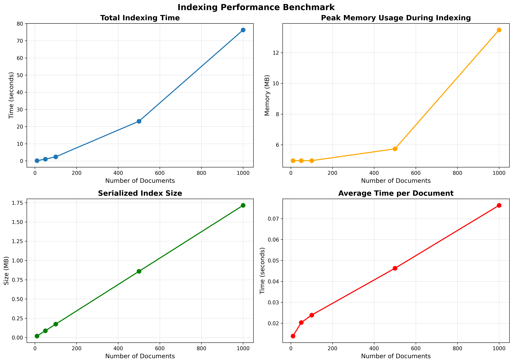
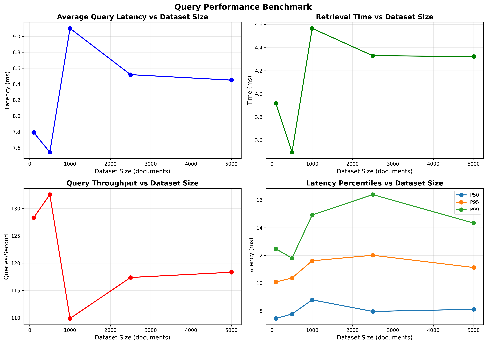
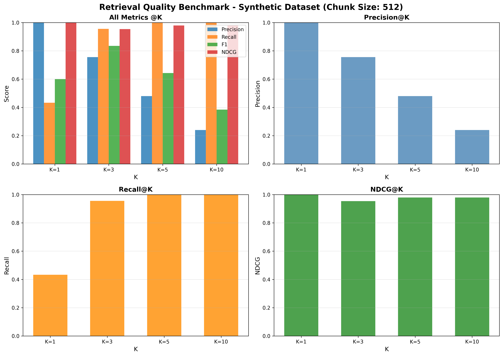

## capybaradb

A lightweight vector database implementation built from scratch in Python. CapybaraDB provides semantic search capabilities using with support for document chunking, text extraction functions from multiple file formats, and flexible storage options.

---

### Indexing Performance

Data source: [benchmark_results/indexing_performance.json](https://github.com/capybara-brain346/capybaradb/blob/main/benchmark_results/indexing_performance.json)



- Document counts tested: 10, 50, 100, 500, 1000
- Total times (s): 0.138, 1.015, 2.388, 23.126, 76.331
- Average time per doc (s): 0.0138, 0.0203, 0.0239, 0.0463, 0.0763
- Storage times remain small relative to embedding time even at 1k docs (≈0.122 s)
- Index size (MB): 0.020, 0.089, 0.174, 0.859, 1.715
- Peak memory (MB): ~2.2–65.4 across scales

Key takeaways:

- Embedding dominates total indexing time. Storage overhead is negligible in comparison.
- Linear growth with dataset size; average time per document rises as batches get larger and memory pressure appears.
- Index size scales linearly and remains compact for thousands of chunks.

Refer to `benchmark_results/indexing_performance.png` for the trend lines and `indexing_performance_breakdown.png` for stacked time components.

---

### Query Performance

Data source: [benchmark_results/query_performance.json](https://github.com/capybara-brain346/capybaradb/blob/main/benchmark_results/query_performance.json)



- Dataset sizes tested: 100, 500, 1000, 2500, 5000
- Average query latency (ms): 7.79, 7.54, 9.10, 8.52, 8.45
- Throughput (qps): 128.3, 132.6, 109.9, 117.4, 118.3
- p50 latency (ms): 7.45–8.79
- p95 latency (ms): 10.09–12.01
- p99 latency (ms): 11.80–16.39
- Breakdown (avg):
  - Embedding time (ms): ~3.87–4.53
  - Retrieval time (ms): ~3.50–4.57

Observations:

- Latency remains stable and low (≈7–9 ms on average) from 100 to 5000 vectors for top-k search, reflecting efficient vectorized exact search.
- Throughput remains >100 qps at all tested sizes.
- The split between query embedding and retrieval remains balanced; both contribute roughly half of total latency.
- Note: one anomalous value appears in `min_latency_ms` at 500 (-524.27 ms). This is a measurement artifact and should be ignored; distributional statistics (p50/p95/p99) are consistent and reliable.

Charts: `benchmark_results/query_performance.png` and `query_performance_breakdown.png` visualize latency distributions and the embedding vs retrieval split.

---

### Retrieval Quality (Synthetic)

Data source: [benchmark_results/retrieval_quality_synthetic.json](https://github.com/capybara-brain346/capybaradb/blob/main/benchmark_results/retrieval_quality_synthetic.json)

![[query-performance.png]]

![[retrieval-benchmark.png]]

Configuration:

- Dataset: Synthetic
- Chunk size: 512

Quality metrics:

- Precision@k: P@1=1.00, P@3≈0.756, P@5≈0.480, P@10≈0.240
- Recall@k: R@1≈0.433, R@3≈0.956, R@5=1.00, R@10=1.00
- F1@k: F1@1=0.60, F1@3≈0.836, F1@5≈0.643, F1@10≈0.385
- nDCG@k: nDCG@1=1.00, nDCG@3≈0.954, nDCG@5≈0.979, nDCG@10≈0.979

Interpretation:

- Very strong early precision (P@1=1.0) and nDCG across cutoffs indicate effective ranking of the most relevant content.
- Near-perfect recall by k=5 shows top-5 captures essentially all relevant items.

See `benchmark_results/retrieval_quality_synthetic.png` for the quality curves.

**Disclaimer** ⚠️: The documents in the dataset used here are relatively short (typically well under 512 tokens).  
As a result, a chunk size of 512 effectively corresponds to _document-level embeddings_ — each document was indexed as a single vector.  
While this setup is sufficient for small-scale or toy benchmarks, it may not generalize to longer documents where sub-document (passage-level) chunking becomes necessary for finer-grained retrieval.  
Future evaluations will include experiments with smaller chunk sizes (e.g., 128–256) and longer document corpora to assess chunk-level retrieval effects.

---

### Features

- **Semantic Search**: sentence-transformers for accurate semantic similarity search
- **Document Chunking**: Optional token-based chunking using tiktoken for better search granularity
- **Multiple File Formats**: Support for PDF, DOCX, and TXT files with OCR capabilities
- **Flexible Storage**: In-memory or persistent storage with automatic serialization
- **GPU Support**: CUDA acceleration for faster embedding generation and search
- **Precision Control**: Support for different precision levels (float32, float16, binary)
- **Collection Management**: Organize documents into named collections

### Installation

Clone the repo

```bash
git clone https://github.com/capybara-brain346/capybaradb.git
```

```bash
cd capybaradb
```

Setup environment

**using venv**

```bash
python -m venv venv
source venv/bin/activate  # on macOS/Linux
venv\Scripts\activate     # on Windows
pip install -r requirements.txt
```

**using uv**

```bash
uv sync
```

## Quick Start

```python
from capybaradb.main import CapybaraDB

# Create a database with chunking enabled
db = CapybaraDB(collection="my_docs", chunking=True, chunk_size=512)

# Add documents
doc_id = db.add_document("Capybaras are the largest rodents in the world.")
db.add_document("They are semi-aquatic mammals native to South America.")

# Search for similar content
results = db.search("biggest rodent", top_k=3)
for result in results:
    print(f"Score: {result['score']:.4f}")
    print(f"Text: {result['text']}")
    print(f"Document: {result['document']}")
    print("---")

# Save the database
db.save()
```

### File Processing

CapybaraDB can process various file formats:

```python
from capybaradb.utils import extract_text_from_file

# Extract text from different file types
text = extract_text_from_file("document.pdf")
text = extract_text_from_file("document.docx")
text = extract_text_from_file("document.txt")

# Add the extracted text to the database
doc_id = db.add_document(text)
```

### Configuration Options

```python
db = CapybaraDB(
    collection="my_collection",    # Collection name (optional)
    chunking=True,                 # Enable document chunking
    chunk_size=512,               # Chunk size in tokens
    precision="float32",          # Embedding precision: "float32", "float16", "binary"
    device="cuda"                 # Device: "cpu" or "cuda"
)
```

### API Reference

#### Constructor

- `collection` (str, optional): Name of the collection
- `chunking` (bool): Enable document chunking (default: False)
- `chunk_size` (int): Size of chunks in tokens (default: 512)
- `precision` (str): Embedding precision (default: "float32")
- `device` (str): Device for computation (default: "cpu")

#### Methods

- `add_document(text: str, doc_id: str = None) -> str`: Add a document to the database
- `search(query: str, top_k: int = 5) -> List[Dict]`: Search for similar documents
- `get_document(doc_id: str) -> str`: Retrieve a document by ID
- `save()`: Save the database to disk
- `load()`: Load the database from disk
- `clear()`: Clear all data from the database

### License

This project is licensed under the MIT License - see the LICENSE file for details.
